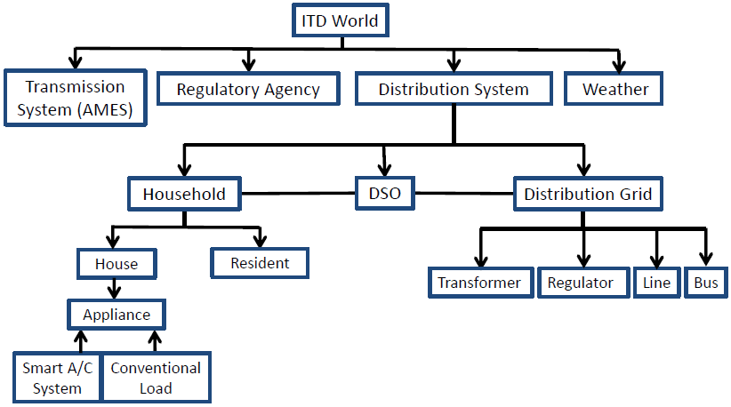
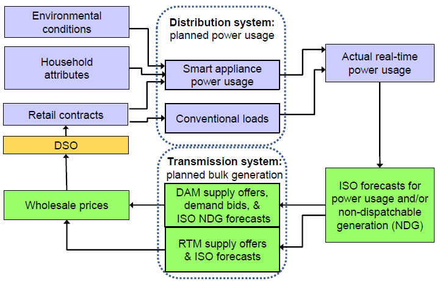
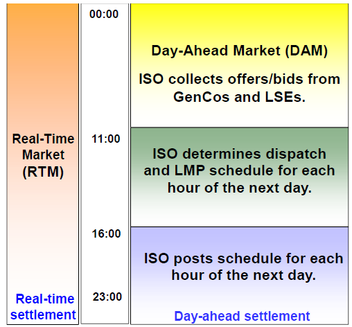
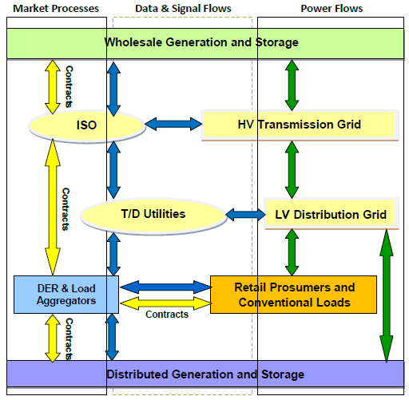
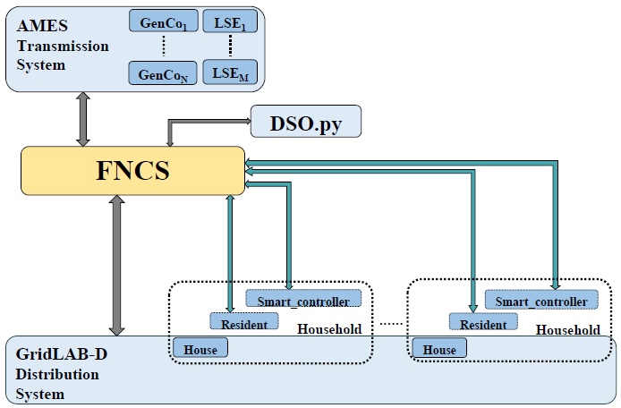
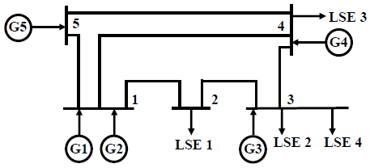
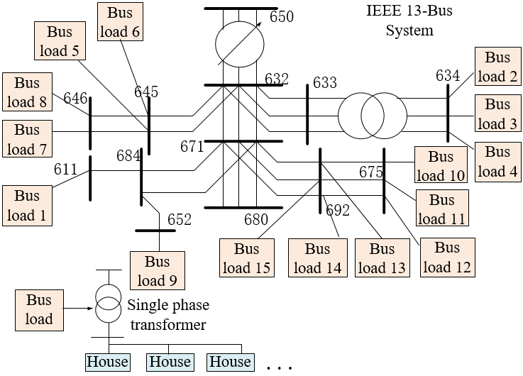
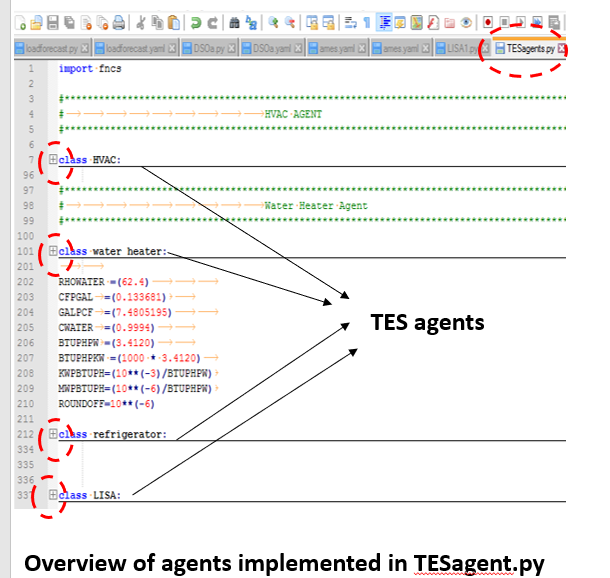
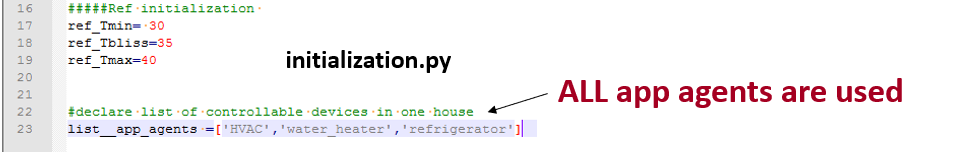
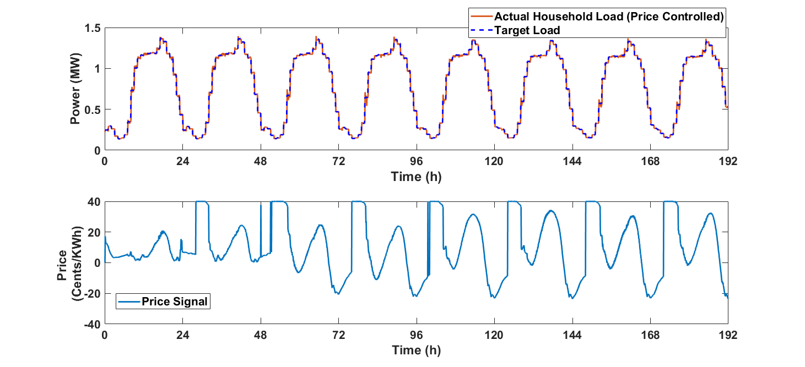

.. role:: math(raw)
   :format: html latex
..
Abstract
======================================
This is the documentation for the ITD TES System code repository https://github.com/htnnguyen/ITD_TES

Key Links
======================================
[1] Our working paper (https://lib.dr.iastate.edu/econ_workingpapers/41)

[2] Our ITD project site (http://www2.econ.iastate.edu/tesfatsi/ITDProjectHome.htm)

Acknowledgement of Support
======================================

This work has been supported by contract #3390511 with the Pacific Northwest National Laboratory operated for the U.S. Department of Energy under Contract DE-AC65-76RLO1830, and by the U.S. Department of Energy Office of Electricity Delivery and Energy Reliability (DE-OE0000839). 

Developers
======================================

1. Hieu Trung Nguyen (hieutn1223@gmail.com) 

2. Swathi Battula (swathi@iastate.edu)

3. Rohit Reddy Takkala (rohit@iastate.edu)

4. Zhaoyu Wang (wzy@iastate.edu)

5. Leigh Tesfatsion (tesfatsi@iastate.edu)

ITD TES System 
======================================

.. sidebar:: 

  |logo|

This is the source code described in the following economics working paper: Nguyen, Hieu Trung; Battula, Swathi; Takkala, Rohit Reddy; Wang, Zhaoyu; and Tesfatsion, Leigh, "Transactive Energy Design for Integrated Transmission and Distribution Systems" (2018). Economics Working Paper 18004, Department of Economics, Iowa State University. (https://lib.dr.iastate.edu/econ_workingpapers/41). 

Goals
-----

We present an open source agent-based platform specifically tailored to permit careful dynamic performance evaluation of transactive energy system (TES) designs for integrated transmission and distribution (ITD) systems. The platform models a centrally-managed wholesale power market operating over a transmission grid linked to one or more distribution systems,
where each distribution system consists of a collection of distributed energy resources operating over a distribution grid. Test case findings are presented to illustrate the capabilities of the platform. The test cases implement a
transmission system linked to a distribution system populated by households that have smart price-responsive appliances as well as conventional loads. Transactions at the distribution level are conducted in accordance
with a bid-based TES design known as the PowerMatcher.

Motivation
-----
|image1|

Figure 1. TES designs can induce tight two-way T-D linkages.

TES designs are hybrid economic-control mechanisms that permit a balancing of power demands and supplies across an
entire electrical infrastructure via value-based transactions. Interest in TES designs has been growing rapidly in response to technological developments, such as smart metering and intelligent devices, that facilitate the participation of retail customers in power system transactions through two-way communication channels. Figure 1 shows how TES implementations within ITD
systems can induce tight two-way linkages between transmission and distribution level operations through market processes, two-way data and signal flows, and two-way power flows. The dynamics of ITD systems operating under TES designs thus tend to be extremely complex. The difficulties facing ITD TES designers can be summarized in the form
of five critical challenges, as follows:
1. The validation of ITD TES designs prior to real-world implementation requires an ITD test system permitting the high-fidelity modeling and simulation of physical attributes, institutional arrangements, and decision-maker behaviors and methods.
2. This ITD test system should model ITD systems as open-ended dynamic systems in order to permit performance evaluation for proposed TES designs over successive days of operation.
3. This ITD test system should permit careful modeling of linkages between transmission and distribution systems.
4. This ITD test system should permit careful evaluation of the physical viability of grid operations and the economic viability of all participants taking their local objectives and constraints into account.
5. This ITD test system should easily scale to permit consideration of TES designs for the procurement of power and ancillary services from DERs as the number and diversity of these DERs continues to increase

The ITD TES System developed and implemented in this work is an agent-based platform that permits each of the above five challenges to be carefully addressed.

Overview
-----------------------------
|image2|

Figure 2. Partial agent hierarchy for the ITD TES System.

The ITD TES System is an agent-based platform that permits the modeling of transmission and distribution systems linked by market processes, two-way data and signal flows, and two-way power flows. A partial agent
taxonomy for this test system is depicted in Figure 2. Down-pointing arrows
indicate has a relations, and up-pointing arrows indicate is a relations. Figures 3 and 4 depict key operational aspects of the ITD TES System in the form of flow diagrams, i.e., the daily timing of day-ahead and real-time
wholesale power market operations and the two-way feedback between transmission and distribution systems.

|image3|

Figure 3. Flow diagram for ITD TES System depicting two-way feedback between transmission and distribution levels.

|image4|

Figure 4. Daily operation of day-ahead and real-time markets in the ITD TES System, implemented via AMES (v3.2). 

Key Software Components
-----------------------------

As depicted in Figure 5, the four principal software components comprising
the ITD TES System are as follows:

1. A transmission system, implemented by the AMES Wholesale
Power Market Test Bed;

2. A distribution system, implemented by GridLAB-D  and by
plug-in resident, appliance, and controller agents implemented in Python;

3. A DSO agent, implemented in Python, with both economic and
control methods

4. TCP/IP middleware to handle communication among C1-C3, implemented by FNCS.

|image5|

Figure 5. Key software components for the ITD TES System

ITD Test Cases
--------------------------------------

Each ITD test case models a DSO-managed distribution system linked to an ISO-managed transmission system. Distribution system transactions are conducted in accordance with a PowerMatcher TES design, and transmission system transactions are conducted in accordance with a two-settlement system consisting of daily ISO-managed DAM and RTM operations with grid congestion handled by LMP.  As depicted in Figure 6, the distribution system consists of a 13-bus distribution grid populated with households dispersed across 15 bus loads. Each household has two basic types of appliances: (i) conventional (non-priceresponsive) load; and (ii) an HVAC system locally managed by a smart price-responsive controller with bang-bang (ON/OFF) control settings. As
depicted in Figure 7, the transmission system consists of a 5-bus transmission grid populated by five GenCos, three regular LSEs 1-3, and the DSO functioning as an additional LSE 4 at transmission bus 3.

|image6|

Figure 6. A 13-bus distribution grid managed by a DSO

|image7|

Figure 7. A 5-bus transmission grid managed by an ISO, with the DSO
participating as LSE 4 at transmission bus 3.

Using and Customizing the ITD_TES
==============================

TESP runs on Microsoft Windows. The user needs to install AMES V3.2, GridLAB-D, and the Framework for Network Co-Simulation (FNCS). The Matlab and Python folder files contain some examples showing how to modify the GridlabD glm files to customize the number of houses and appliances, automatically generate yaml files to communicate data via TCP/IP 5570 (done via FNCS).

Run file: run_540_class.bat to get the simulation results.

List of supported TES agents and TES designs:

1. HVAC

2. Water Heater

3. Refrigerator

4. PowerMatcher

5. ISO-managed wholesale power market

The file TESAgent.py includes the following four classes, as shown in Figure 8:

1. Class HVAC

2. Class Waterheater

3. Class Refrigerator

4. Class LISA (Local Intelligent Software Agent). LISA represents the Home Energy Management System.

|image8|

Figure 8. Overview of TESagents.py

The simulation setting can be configured by modifying Initialization.py; see Figure 9.

|image9|

Figure 9. Overview of Initialization.py

The outcome of a simulation with water heaters and HVACs for 540 houses over 8 simulated days is depicted in Figure 10:

|image10|

Figure 10. Simulation results

